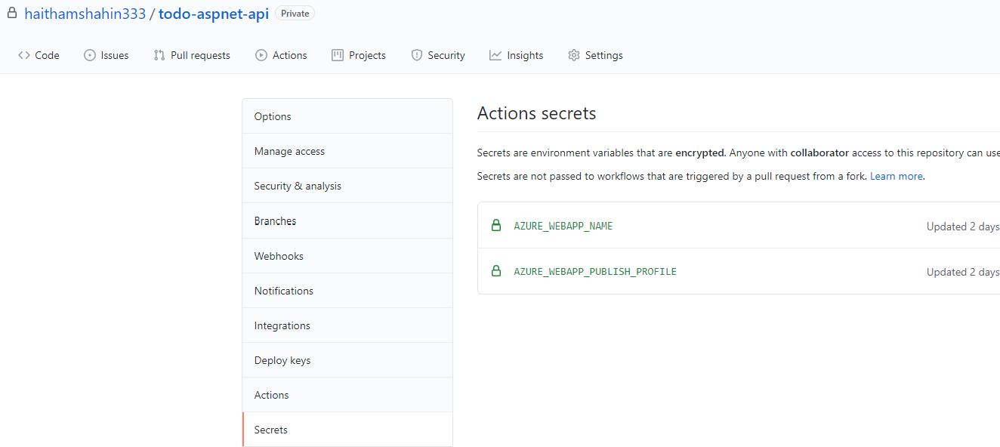
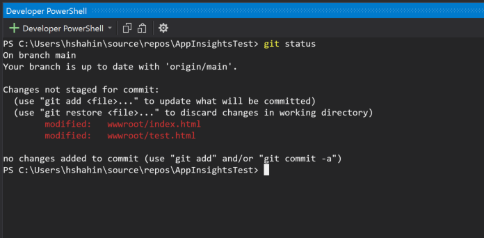

# Application Insights Overview with ASP.NET Core and JavaScript Client

This repository contains an example/overview for how to deploy and use [Application Insights](https://docs.microsoft.com/en-us/azure/azure-monitor/app/app-insights-overview), which is an Application Performance Management service under [Azure Monitor](https://docs.microsoft.com/en-us/azure/azure-monitor/).

This walkthrough is divided into Lab sections for your review and use. Multiple labs link back to the upstream Azure documentation/tutorials so that as updates are made upstream, these steps can remain aligned. Additionally, the documentation is a great resource to become familiar with as you look to grow your knowledge on Application Insights and dive deeper into specific topics.

Feel free to modify and deviate from this flow, the goal here is to provide you with the necessary steps and resources/links that can be used to ultimately demonstrate the following:

1) Setup Application Insights in the FrontEnd and BackEnd
2) Observe Telemetry in Azure (using Dashboards, custom Queries, etc.)
3) Understand how to create Alerts and make decisions from the telemetry

As issues/questions/enhancements arise, feel free to create issues in this repository and make a PR to contribute back additional learnings.

References:
  - [Create a Log Analytics Workspace](https://docs.microsoft.com/en-us/azure/azure-monitor/logs/quick-create-workspace)
  - [Example Templates for Insights Deployments](https://github.com/Azure/azure-quickstart-templates/tree/master/quickstarts/microsoft.insights)
  - [Azure Monitor Logs Overview](https://docs.microsoft.com/en-us/azure/azure-monitor/logs/data-platform-logs)
  - [Manage usage and costs](https://docs.microsoft.com/en-us/azure/azure-monitor/logs/manage-cost-storage#changing-pricing-tier)
  - [Azure Monitor Pricing](https://azure.microsoft.com/en-us/pricing/details/monitor/)
  - [Metric Definition](https://docs.microsoft.com/en-us/azure/azure-monitor/app/standard-metrics)
  - [Tutorial: Create To-do Web API](https://docs.microsoft.com/en-us/aspnet/core/tutorials/first-web-api?view=aspnetcore-5.0&tabs=visual-studio)
  - [Tutorial: Call API with JavaScript](https://docs.microsoft.com/en-us/aspnet/core/tutorials/web-api-javascript?view=aspnetcore-5.0)

Prerequisites:
  - Azure Subscription
  - IDE / Local Dev Environment for .NET Core (steps below tested with Visual Studio 2019, but if you prefer a different IDE / Dev Environment you can run the app locally using your preferred tools and processes).

# Lab 0 - Import the Repository and Run Locally

## Overview

The initial step in working with this content will be to Import this repository into your own personal GitHub repo as a Private Repository so that you can begin to work through the labs.

If you want to learn more about the To-do app being used in these labs and how it was developed, follow the tutorials linked in the references above. The additional test links are not documented in that tutorial, but can be found in the `Controllers/LinksController.cs` file - feel free to update/modify as needed for additional tests.

The app is made to be a basic example of a Web API with a FrontEnd to keep the focus on the usage of Application Insights. I recommend that once you are comfortable with these steps and concepts, you apply them to your own applications and customize.

## Steps

  1. Select the Import button at the top of this repository so you can have a personal copy of the repo. The Repository's Clone URL will be this repo (https://github.com/haithamshahin333/todo-aspnet-api). Select the Private repository so that your copy is not publically accessible.

  > Info: Even after you Import the repo, be sure to continue to monitor this repo (the upstream repo) so that you can continue to pull in updates/enhancements as they are committed. This will allow you to stay updated with the latest content.

  

  

  2. Run a `git clone` to your local machine to pull down the code or clone your new repo into Visual Studio.

  3. Open the Solution File in Visual Studio and Run the App. This can also be run in VS Code with a `dotnet run` command.

  4. Validate that the app opens locally and you should see the following To-do CRUD app:

  

  > Info: The app is using an in-memory DB and the FrontEnd is being served from the wwwroot folder for consolidation and ease of deployment. Update these components as you look to personalize this experience.

  > Info: The 'View Test Links' has different links to simulate different interactions for the app (dependency call to this [test json data](https://raw.githubusercontent.com/haithamshahin333/json-test-data/main/testdata.json) in one of my repos, a 404 failure, a 503 failure, and a sleep). Try these different links as you look to learn more about what telemetry and events are monitored with App Insights.

# Lab 1 - Deploy Azure Resource for Application Insights

## Create Log Analytics Workspace

### Overview:

Data collected by [Azure Monitor Logs]((https://docs.microsoft.com/en-us/azure/azure-monitor/logs/data-platform-logs)) is stored in Log Analytics Workspaces, including log data from Application Insights when creating a workspace-based application.

In this lab, we will create the Log Analytics Workspace needed to support our Application Insights deployment. Creating a Log Analytics workspace is not required if you already have one provisioned in your Azure subscription that you can use for these labs.

### Steps:

  1. Create a Resource Group to be used for this exercise in the portal by searching for 'Resource Groups' in the Azure Portal.

  2. Create a Resource Group named 'app-insights-testing' and click 'Create' (you can create a custom name as well):

  

  3. From here, follow this [tutorial](https://docs.microsoft.com/en-us/azure/azure-monitor/logs/quick-create-workspace) and create the log analytics workspace in the 'app-insights-testing' resource group.

  4. Once complete, confirm that the Deployment succeeded and you should be able to select the resource and see the Log Analytics workspace overview tab.

## Create a Workspace-based Application Insights Resource

### Overview:

[Workspace-based Application Insights](https://docs.microsoft.com/en-us/azure/azure-monitor/app/create-workspace-resource) is the latest deployment model for Application Insights.

### Steps:

  1. Similar to the steps above, follow this [tutorial](https://docs.microsoft.com/en-us/azure/azure-monitor/app/create-workspace-resource#create-workspace-based-resource) to create an Application Insights resource within your new resource group.

  > Info: Be sure that the Resource Mode is set to Workspace-based.

  > Info: Be sure that you select the proper Log Analytics resource that will support your Application Insights resource.

  

  2. Once complete, confirm the Deployment succeeded and you should be able to select the resource and see the overview tab (empty metrics at this point since the application is not connected to the resource).

# Lab 2 - Create App Service for Todo App

## Overview

The application being used in this scenario will be deployed as a Web App to [Azure App Service](https://docs.microsoft.com/en-us/azure/app-service/overview). Application Insights is not dependent upon a specific deployment model in this scenario since the App Insights SDK is added in the App. [Codeless Monitoring](https://docs.microsoft.com/en-us/azure/azure-monitor/app/codeless-overview) is more dependent upon the deployment model of the application.

## Steps

  1. Navigate to the 'app-insights-testing' resource group where the Log Analytics workspace and App Insights resources were created.

  2. Select 'Create' and then select 'Web App':

  

  3. Work through the portal and make selections as shown below. Note that the name of the app will need to be unique (below I used my initials with 123 - 'hs123'). Be sure to select `.NET 5` for the Runtime stack:

  

  4. On the Deployment section, select 'Disable'.

  5. On the Monitoring section, select 'No' to Application Insights since we will instrument this with the SDK. If both were selected, the manual/sdk insights would only be respected as described [in the documentation](https://docs.microsoft.com/en-us/azure/azure-monitor/app/azure-web-apps?tabs=net#enable-application-insights).

  6. Select 'Create'. Once the Deployment succeeds, confirm that you can select the resource and see the following page when you select your app url:

   

# Lab 3 - Add Application Insights to the Application and Deploy to App Services

## Add Application Insights SDK

### Overview:

Depending on your IDE, there may be different methods of how to enable Application Insights. [Here are the steps for ASP.NET Core Apps](https://docs.microsoft.com/en-us/azure/azure-monitor/app/asp-net-core).

### Steps:

  1. In this scenario, the SDK is already added, so no action to be taken here. Reference this [tutorial](https://docs.microsoft.com/en-us/azure/azure-monitor/app/asp-net-core) to learn how to add the Application Insights SDK to your own app.

  2. If configuring from your IDE, be sure that the connection string to app insights is not committed to a public repo! Copy the `appsettings.json` file and rename the copy as `appsettings.Development.json`.

  > Info: The file name `appsettings.Development.json` is added to the `.gitignore` file in the root of the repo. Therefore, even if you had your connection string here locally as you debug, it won't be committed back to your fork.

  3. Add the app insights connection string to your appsettings.Development.json file so you can test running it locally. You can find the connection string in the Azure portal on the Overview tab for your App Insights resource. Copy and paste the string in the corresponding section of the JSON file:

  ```
    "ApplicationInsights": {
      "ConnectionString": "PASTE_CONNECTION_STRING"
    }
  ```

  4. Under the `wwwroot` folder, you should see the `index.html` file and the `test.html` files. In both of those, you will add the Instrumentation Key (not the connection string as you did for the BackEnd) to the JavaScript snippet that enables Application Insights. To add app insights to the client-side, follow this [tutorial for JavaScript](https://docs.microsoft.com/en-us/azure/azure-monitor/app/javascript).

  > Info: Read this article on some approaches for how to protect your instrumentation key: [Alternative way to protect your Application Insights “Instrumentation Key” in JavaScript](https://devblogs.microsoft.com/premier-developer/alternative-way-to-protect-your-application-insights-instrumentation-key-in-javascript/)

  ```
      <script type="text/javascript">


        ...... 


              cfg: { // Application Insights Configuration
                  instrumentationKey: "ADD_INSTRUMENTATION_KEY"
                  /* ...Other Configuration Options... */
              }
          });
      </script>
  ```

  5. To validate the setup, run the app locally and then navigate to Live Metrics tab on the Application Insights resource in the Azure Portal to confirm that data is being streamed to Azure (try making requests to your app running locally to see the charts produce data):

  

## Deploy to App Services

### Overview:

There are many ways to deploy apps to App Services. You can do so with [GitHub Actions](https://docs.microsoft.com/en-us/azure/app-service/deploy-github-actions?tabs=applevel), [Azure Pipelines](https://docs.microsoft.com/en-us/azure/devops/pipelines/tasks/deploy/azure-rm-web-app-deployment?view=azure-devops), and with [Visual Studio Publishing Profiles](https://docs.microsoft.com/en-US/visualstudio/deployment/tutorial-import-publish-settings-azure?view=vs-2019).

This repository and the steps documented below use GitHub Actions, but if you prefer to deploy from Visual Studio, follow this [tutorial](https://docs.microsoft.com/en-US/visualstudio/deployment/tutorial-import-publish-settings-azure?view=vs-2019) to see how you can use the Publishing Profile from your App Service with Visual Studio to deploy the app.

### Steps:

  1. Navigate to your App Service and under Configuration, select 'New application setting' and add `APPLICATIONINSIGHTS_CONNECTION_STRING` as a new application setting. The value will be your Connection String:

  > Info: Be sure to Save the new setting before leaving the page.

  

  2. In your Private GitHub repository, navigate to `settings -> secrets` so we can create the secrets needed by our workflow to deploy to Azure. The two secrets that need to be created as shown below:

  ```
  Secret 1) AZURE_WEBAPP_NAME=paste_app_service_name

  Secret 2) AZURE_WEBAPP_PUBLISH_PROFILE=paste_publish_profile_from_app_service_overview (On the overview, download the file by selecting 'Get publish profile')
  ```

  

  3. Once the secrets are set, you can commit the local changes you made to the files in the `wwwroot` folder back to the repo, which will trigger the workflow on the Main branch to deploy the app your App Service resource.

  > Info: Confirm that when you run `git status` you only see the two files being committed are under the `wwwroot` folder:

  

  4. Confirm that the workflow runs successfully and you should now see the App running on App Services. On the overview tab, you can select the URL and you should see the To-do home page as you saw when running locally.

# Lab 4 - Understand Overview and Create Basic Dashboard

## Overview

The Overview tab right when you select into App Insights gives an immediate view of important charts and metrics that are relevant to the observability and performance of your app. Here is the [documentation reference](https://docs.microsoft.com/en-us/azure/azure-monitor/app/overview-dashboard) on this overview.

## Steps

  1. Navigate to your App Insights Resource and select the Overview tab.

  2. Select into Failed Requests. You can drill down into the data by selecting on the different operations:

  

  3. Let's create a Failure Dashboard where we can continue to track this information. On the Portal Home Screen, select the pop-out blade on the left and Select 'Dashboard':

  

  4. Select New Dashboard, Blank Dashboard. From there, title the Dashboard 'Failure Dashboard'.

  5. Navigate back to your Failed Requests overview and select the pin - you can then select your new Failure Dashboard to pin that tile to the Dashboard.

  6. Additional steps for adding [log data](https://docs.microsoft.com/en-us/azure/azure-monitor/visualize/tutorial-logs-dashboards) and [application data](https://docs.microsoft.com/en-us/azure/azure-monitor/app/tutorial-app-dashboards) to the dashboard.

# Lab 5 - Create an Alert

## Overview

Creating alerts against the metrics and logs being streamed up to App Insights allows for automated actions and awareness through email/sms etc. Here is the [documentation reference](https://docs.microsoft.com/en-us/azure/azure-monitor/alerts/alerts-log) for how to create and manage alerts.

## Steps

  1. First, navigate to Log Analytics and let's create a basic query that will return failed requests for a particular Operation we are interested in:

  ```
  requests
  | where success == false and operation_Name has "GET /failure"
  ```

  2. Once the query is created, we can select New Alert Rule directly from the query editor:

  

  3. In the Alert view, select the condition and configure the signal as shown below:

  

  4. In a separate tab before continuing with creating that Alert, open up the Azure Portal and go to create an Action Group by Searching for Alerts. From there when on the page for Alerts, select Manage Actions:

  

  5. Go through the form for adding a [new action group](https://docs.microsoft.com/en-us/azure/azure-monitor/alerts/action-groups). No actions are required (you can setup an email alert for this scenario).

  6. Once complete, go back to the alert rule creation form and select that action group.

  7. You can add an email subject and description and enable the rule upon creation.

  8. Go ahead and trigger an alert by hitting your app at the '/failure' endpoint.

  9. Finally, navigate back to the Log Analytics query used for the alert and add it to your Failure Dashboard.

# Lab 6 - Create an Availability Test

## Overview

  In App Insights, you can setup URL ping tests (which isn't actually a "ping" but is really an HTTP request) to capture the continuous health and availability of your app. Here is the [overview](https://docs.microsoft.com/en-us/azure/azure-monitor/app/monitor-web-app-availability) on the feature for further information.

## Steps

  1. Navigate to your Application Insights resource.

  2. Select the Availability tab which won't have data at this point.

  3. Click on 'Add a Test' and setup a test as shown below:

  

  > Info: This is a [tutorial](https://docs.microsoft.com/en-us/azure/azure-monitor/app/monitor-web-app-availability) going through a similar exercise as reference.

  4. Once the tests are up and running, you should begin to see data stream in the graph:

  

  > Info: As an aside, you can also see the duration of requests from those different locations which helps to understand how performance is from different regions.

# Lab 7 - User Behavior

## Overview

  By adding the Instrumentation Key to the JavaScript files in our app, we are able to get client-side usage behavior and data. This allows us to better understand our users and how we can design the app to support them. Here is the [documentation page](https://docs.microsoft.com/en-us/azure/azure-monitor/app/usage-overview).

## Steps

  1. Navigate to your application insights resource.

  2. Scroll down to the Usage blade on the left - you will find there the metrics gathered for your usage behavior insights.

  3. Select Users as shown below and then View More Insights - you should see a screen similar to what is below:

  

  4. To view how users are being funneled through your app, select Funnels under Usage

  5. Create a funnel like what is shown below:

  

  6. Hit the View tab to see the results and how users are being retained as they work through the site
